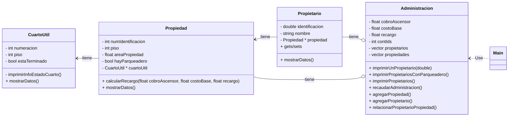

## Torres de Niza - ejercicio de práctica con código existente

Este documento te guiará en el desarrollo del sistema de administración de propiedades del conjunto **Torres de Niza**, aplicando conceptos clave de **POO en C++**. Aprenderás sobre la interacción entre clases, gestión dinámica de memoria, y cómo usar **apuntadores y referencias**.

 En este enunciado interesa que puedas:

- leer un enunciado y ver la relación entre clases, atributos, métodos y relaciones
- comprender la separación entre archivos `.h` y `.cpp`
- reconocer cuándo aparece memoria dinámica
- ver cómo se usan apuntadores en algunas relaciones entre objetos
- distinguir entre pasar por valor, pasar por referencia y trabajar con `const`
- continuar tu preparación prepararte para el siguiente parcial, donde tendrás que analizar diseño y código. 


## Objetivos

- Configurar y utilizar un entorno de desarrollo integrado (IDE) para compilar y ejecutar el proyecto
- Analizar y comprender la estructura del código fuente proporcionado
- Implementar clases y sus relaciones en un lenguaje de programación orientado a objetos
- Comprender como se articulan proyectos orientados a objetos cuando diferentes clases se interralacionan entre si
- Comprender el uso de **referencias** y **apuntadores** en C++.
- Explorar cómo se maneja la **gestión dinámica de memoria**.
- Identificar el uso de **destructores** para la correcta liberación de memoria.
- Aplicar estos conceptos en un proyecto orientado a objetos.


💡 **Metodología:**
1. **Lee el enunciado completo** antes de abrir el código.
2. **Explora el código fuente**.
    * **Abre el proyecto en Code::Blocks** y familiarízate con los archivos.
    * **Revisa primero el `Main.cpp`** para entender el flujo general.
    *. **Observa las clases del sistema** y su responsabilidad.
    *. **Relaciona el código con el problema**: qué clase representa qué parte del enunciado.
    *. **Identifica referencias, apuntadores y uso de `const`**.
    *. **Compila, ejecuta, modifica y vuelve a probar**.
3. **Realiza los ejercicios propuestos** para reforzar conceptos.
4. **Responde por escrito las preguntas de reflexión** al final.

## Obtener el código fuente 

### Exploración en CodeBlocks [ No es necesario si usa CLION o VsCode]
##### 1. Tener instalado Code::Blocks con compilador

Asegúrate de tener una instalación funcional de **Code::Blocks** con compilador de C++.

Si ya lo tienes instalado, abre el programa y revisa que el compilador esté configurado en:

- `Settings > Compiler`

Si al compilar aparece un error relacionado con el compilador, revisa esa sección antes de seguir.

##### 2. Obtener el proyecto

Puedes clonar el repositorio o descargarlo como `.zip`.

Si usas Git, el comando es:

```bash
git clone https://github.com/lufe089/ejm_mem_dinamica_obj.git
```

Si no usas Git(todavía), puedes descargar el repositorio desde GitHub en formato zip y descomprimirlo en una carpeta de trabajo.

##### 3. Crear el proyecto en Code::Blocks

Como el repositorio no trae un archivo `.cbp`, en Code::Blocks conviene trabajar así:

###### Opción recomendada: proyecto vacío

1. Abre **Code::Blocks**
2. Ve a **File > New > Project**
3. Selecciona **Empty project**
4. Asigna un nombre al proyecto
5. Guarda el proyecto en una ubicación conveniente

> Esta opción es la más segura porque evita que Code::Blocks genere un `main` adicional.

###### Opción alternativa: Console application

También puedes crear una aplicación de consola, pero si Code::Blocks genera un `main.cpp` automático, deberás eliminarlo o no agregarlo al proyecto, porque el repositorio ya trae su propio `Main.cpp`.

##### 4. Agregar los archivos existentes

Una vez creado el proyecto:

1. Haz clic derecho sobre el nombre del proyecto
2. Selecciona **Add files...**
3. Busca la carpeta `src`
4. Agrega todos los `.cpp` y `.h`

Asegúrate de incluir estos archivos del proyecto:

- `src/Main.cpp`
- `src/Administracion.cpp`
- `src/Administracion.h`
- `src/Propietario.cpp`
- `src/Propietario.h`
- `src/Propiedad.cpp`
- `src/Propiedad.h`
- `src/CuartoUtil.cpp`
- `src/CuartoUtil.h`

> Cuando Code::Blocks pregunte si deseas agregarlos a **Debug** y **Release**, puedes aceptar ambas opciones.
---

<details>
<summary> Exploración en Visual Studio Code [ No es necesario si usa CLION o codeblocks] </summary>
### Clonar el repositorio
    - Abre una terminal y clona el repositorio con el siguiente comando:&#8203;:contentReference[oaicite:2]{index=2}
      ```bash
      git clone https://github.com/lufe089/ejm_mem_dinamica_obj.git

    - Alternativamente si aún no has terminaodo tu formación en git y github descarga el comprimido zip
    
### Exploración en Visual Studio Code 
- Agregue la extensión C++
- Agregue la extensión de Markdown
- Instale Cmake en su PC y haga la configuración
- Instale Make en su PC ( si no es linux o Mac) y haga la configuración
- Abra y observe los archivos `CMakePresets.json` y `CMakeLists.txt`

- Navegue por el código fuente del proyecto
- Configure el CMake y compile el proyecto. Aquí puede encontrar un video que explica cómo hacerlo: https://code.visualstudio.com/docs/cpp/CMake-linux. Note que el proyecto ya tiene el `CMakeList` y el `CmakePresets.json`
</details>

<details>
<summary> Exploración en CLION [ No es necesario si usa VsCode o codeblocks] </summary>
### Exploración en CLION
2. **Abrir el proyecto en CLion**:
* En CLion, selecciona "Abrir" en la pantalla de bienvenida o en el menú "Archivo".​
* Navega hasta la carpeta del proyecto clonado y selecciona el archivo CMakeLists.txt.​
* Haz clic en "Abrir" y luego en "Abrir como Proyecto".

3. **Configurar y compilar el proyecto**
* CLion configurará automáticamente el proyecto utilizando CMake. Espera a que finalice la configuración.
* Si es necesario, selecciona la configuración de compilación en la esquina superior derecha de la ventana (usualmente "Debug" o "Release").
* Haz clic en el botón "Build" para compilar el proyecto.
</details>

## 🔥Exploración del código fuente
Primero explore el diagrama UML del enunciado disponible al final de este documento, luego recorra el código fuente desde el IDE que hubiera seleccionado en esta orden:

#### Panel izquierdo: árbol del proyecto
En el panel izquierdo dede el IDE podrás ver los archivos agregados. Úsalo para:

- ubicar rápidamente las clases
- distinguir archivos `.h` y `.cpp`
- reconocer cuántos archivos participan en la solución

#### Primero abre `Main.cpp`

Aquí conviene observar:

- qué objeto controla el flujo del programa
- cómo aparece el menú
- qué métodos se invocan desde la lógica principal
- qué trabajo delega `main` a otras clases

#### Luego abre `Administracion.h` y `Administracion.cpp`

Aquí conviene observar:

- qué atributos tiene la clase
- qué métodos expone públicamente
- qué parte del sistema parece coordinar
- dónde se crean objetos dinámicamente
- qué relaciones tiene con otras clases

#### Después revisa las demás clases

Al revisar `Propietario`, `Propiedad` y `CuartoUtil`, pregúntate:

- ¿qué representa esta clase del problema?
- ¿qué atributos necesita para existir?
- ¿qué métodos tiene sentido que posea?
- ¿depende de otra clase?
- ¿tiene una relación con otro objeto mediante apuntador?

### Cómo compilar y leer errores ( en CodeBlocks)

Para compilar:

- usa **Build**
- o **Build and Run**

Si ocurre un error:

1. lee con calma el mensaje de compilación
2. identifica el archivo donde ocurre
3. identifica la línea reportada
4. revisa si el problema está en:
   - un `;` faltante
   - una firma distinta entre `.h` y `.cpp`
   - un método declarado pero no implementado
   - un `#include` faltante
   - un nombre de atributo mal escrito
   - una llave o paréntesis sin cerrar

No intentes corregir varios problemas al mismo tiempo si aún no entiendes el primero.

### Cómo usar Code::Blocks para aprender mejor

Mientras trabajas en el IDE, intenta usarlo como una herramienta de análisis:

- abre al tiempo el `.h` y el `.cpp` de una misma clase
- compara qué se declara y qué se implementa
- vuelve al `Main.cpp` para entender cómo se conectan los objetos
- compila después de cambios pequeños
- si algo falla, registra qué pasó y cómo lo resolviste

El objetivo no entender mejor el código.

### Material de apoyo si aparecen dudas

Si durante el trabajo aparecen dudas sobre:

- referencias
- apuntadores
- uso de `const`
- diferencia entre copiar y referenciar
- acceso con `->`
- memoria dinámica
- relación entre objetos y contenedores

puedes apoyarte en este material complementario:

`https://github.com/lufe089/POO/blob/main/7.ContenedoresObjetos.md`

- por qué una función recibe `const Tipo&`
- cuándo conviene usar referencia y cuándo apuntador
- qué significa que un objeto viva en memoria dinámica
- por qué un contenedor puede guardar apuntadores al mismo objeto
- qué implica que un método sea `const`

## Enunciado 
### Descripción*

El administrador del conjunto bosques de Niza desea contratar un software para la gestión de cobros y descuentos a
propietarios de la unidad.

Todo propietario tiene nombre, identificación y una única propiedad. Cada propiedad tiene un número de piso, un número
de identificación, un área. Algunas propiedades tienen parqueadero y otras no.

Para cada propiedad el propietario debe pagar la administración teniendo en cuenta lo siguiente:

- _Cobro por ascensor_. Vale 15000 pesos que se multiplican por el piso en el que se encuentre el apartamento.

- _El valor base_. Cada apartamento paga 150 mil pesos mensuales. La tarifa podría cambiar cada año.

- _Área_. Hay un recargo del 5 por ciento sobre el valor base para los apartamentos de más de 150mts

La administración quiere:

- Conocer el valor recaudado por administración para todo el edificio.
- Imprimir para cada propietario su información nombre, identificación y piso del apartamento de su propiedad
- Imprimir la lista de propietarios de propiedades que tienen parqueadero
- Imprimir la información de un propietario dado su id
- Agregar nuevas propiedades
- Agregar nuevos propietarios
- Asociar propietarios y propiedades

Existen propiedades que tienen cuarto útil. Este es un espacio de 2x3mts que los apartamentos usan como bodega. A la fecha en el conjunto existen dos tipos de cuarto útil, los que están terminados y los que se encuentran en obra gris. En articular, cuando el curto útil está en obra gris esto quiere decir que los propietarios no han terminado de hacer los arreglos posibles para ese espacio. En ese caso la administración ha decidido hacer un descuento del 1% del valor a pagar en administración para favorecer que los propietarios finalicen la construcción de sus cuartos útiles. Se espera que en el futuro todos los cuartos útiles estén totalmente terminados. Cada cuarto útil tiene una numeración y el número de piso en el que se encuentra.
Además de los reportes pedidos en la primera parte de este trabajo, el administrador ahora quiere saber:

- El nombre de los propietarios cuyas propiedades no tienen cuarto útil
- El nombre de los propietarios cuyas propiedades si tienen cuarto útil y están terminadas.
- El número de los apartamentos que si tienen cuarto útil pero no están terminados.

A la fecha Torres de Niza tiene los siguientes propietarios:

- Debora Vilar. CC 20202492 – Apto 101 – 160mts2 Piso 10 - Parqueadero – Si – Cuarto útil no terminado en el piso 2. Numeración A201
- Ignacio Rodríguez CC 30458 452 – Apto 901 – 30mts2 Piso 9 – Parqueadero – No - Cuarto útil terminado en el piso 2. Numeración A202
- Erika Muñoz CC 1058845781 – Apto 701 – 45mts Piso 7 - Parqueadero – Si - Cuarto útil terminado en el piso 2. Numeración A203
- Modesto Villaverde CC 31 321 432 - Apto 502 – 60 mts Piso 5 - Parqueadero – No – No tiene cuarto útil.

## 🏗️ Integración con gestión Dinámica de Memoria

### 📌 ¿Qué es la memoria en un programa?
Cuando un programa en C++ se ejecuta, utiliza memoria para almacenar datos y ejecutar instrucciones. Esta memoria se divide en diferentes áreas:
- **Stack (Pila)**: Memoria de acceso rápido donde se almacenan variables locales y llamadas a funciones. Se maneja automáticamente.
- **Heap (Montículo)**: Memoria de acceso más flexible que se administra manualmente en C++ con las palabras clave `new` y `delete`. Es aquí donde ocurre la **gestión dinámica de memoria**.

### 📌 ¿Qué es la Gestión Dinámica de Memoria?
Es el proceso de **asignar y liberar memoria manualmente** durante la ejecución del programa. A diferencia de la memoria en el stack, la memoria en el heap **no se libera automáticamente**, por lo que es responsabilidad del programador asegurarse de que no haya **fugas de memoria**.

### 📌 ¿Por qué usar memoria dinámica?
- **Mayor flexibilidad**: Se pueden crear objetos en tiempo de ejecución, adaptando el tamaño de la estructura de datos.
- **Evitar el límite del stack**: Objetos grandes en el stack pueden causar desbordamiento de pila (**stack overflow**).
- **Compartir datos entre funciones**: Los objetos creados en el heap pueden ser accedidos por diferentes funciones sin perder su referencia.

### 📌 Ejemplo en el Código
En el método `inicializarDatos()` de `Administracion.cpp`, se crean varios objetos de forma dinámica:

```cpp
Propietario *persona1 = new Propietario();
Propietario *persona2 = new Propietario();
Propiedad *prop1 = new Propiedad();
CuartoUtil *cuarto1 = new CuartoUtil();}}}

```

Estos objetos se almacenan en el heap, lo que significa que su vida útil no está limitada al bloque de código en el que fueron creados. A diferencia de las variables locales que desaparecen cuando la función termina, los objetos en el heap existen hasta que explícitamente se eliminan con `delete`. Esto es especialmente útil cuando necesitamos que los objetos persistan y sean accesibles desde diferentes partes del programa, incluso después de que la función que los creó haya terminado.

El método destructor llamado ~Administracion() se encarga de eliminar los objetos. 

🔥 **Ejercicio**:
- Modifica `inicializarDatos()` para agregar un mensaje en consola después de cada `new`, indicando que el objeto fue creado exitosamente.

## 🏷️ 2. Referencias en C++

### 📌 ¿Qué es una referencia en C++?
Una **referencia** en C++ es un alias para otra variable. En lugar de almacenar un valor, una referencia actúa como un segundo nombre para una variable existente.

📌 **Diferencias clave entre una referencia y una variable normal**:
1. Una referencia **no ocupa memoria adicional**, ya que simplemente es un alias.
2. Una vez que una referencia se asocia con una variable, **no puede cambiar a otra**.
3. Es útil cuando queremos evitar **copias innecesarias** de datos grandes.

Las referencias simplifican el código y mejoran el rendimiento al evitar copias innecesarias de datos. Son especialmente útiles en los siguientes casos:

1️⃣ Evitar copias innecesarias en funciones
Cuando pasamos datos grandes a una función, hacer una copia es ineficiente. Usamos referencias para evitar esto.

🔍 Ejemplo:
```cpp
void mostrar(const string &texto) {  // Se pasa por referencia para evitar copia
cout << "Texto: " << texto << endl;
}
```
2️⃣ Facilitar la manipulación de objetos
Cuando trabajamos con clases y estructuras, las referencias permiten modificar directamente los atributos sin hacer copias innecesarias.

🔍 Ejemplo en el código:
En Propietario.h, usamos una referencia constante para retornar el nombre:
```cpp
const string &getNombre() const;
```
Esto evita que C++ haga una copia del string, lo que ahorra memoria y tiempo de ejecución.

Cada vez que veas `const`, intenta interpretar su intención:

- `const` en un parámetro: no modificar lo recibido
- `const` en un método: no modificar el objeto
- `const` en un retorno por referencia: no permitir cambios desde afuera

Si estos puntos no te quedan claros, revisa el material de apoyo indicado más arriba.

🔥 **Ejercicio**:

Modifica getIdentificacion() en Propietario.h para devolver una referencia constante

## 🔍 3. Apuntadores

### 📌 ¿Qué son los apuntadores y por qué se crearon en C y C++?

Los **apuntadores** son variables que almacenan la dirección de memoria de otra variable u objeto. Fueron introducidos en **C** para permitir el acceso eficiente a la memoria y mejorar la manipulación de estructuras de datos como arreglos y listas enlazadas. En **C++**, los apuntadores son importantes en la gestión de memoria dinámica, la programación orientada a objetos y el desarrollo de sistemas.

#### 📌 Razones por las que se crearon los apuntadores:
- **Acceso eficiente a la memoria**: Permiten modificar datos directamente en la memoria sin necesidad de hacer copias.
- **Gestión dinámica de memoria**: Se pueden reservar y liberar bloques de memoria en tiempo de ejecución, optimizando el uso de recursos.
- **Manipulación de estructuras de datos complejas**: Son esenciales para la implementación de estructuras como listas enlazadas, árboles y grafos.
- **Interacción con hardware**: Se utilizan en programación de bajo nivel, como controladores de dispositivos y sistemas operativos.

En el código fuente, los apuntadores permiten la **asociación entre objetos**. Por ejemplo, un `Propietario` tiene una propiedad asociada mediante un apuntador:

```cpp
persona1->setPropiedad(prop1);
```

Y una **Propiedad** puede tener un **Cuarto Útil**:

```cpp
prop1->setCuartoUtil(cuarto1);
```

Sin apuntadores, estas relaciones serían muy complicadas de manejar porque implicarían copiar completamente los datos de un objeto dentro de otro. Esto podría generar un uso excesivo de memoria y reducir la eficiencia del programa. En cambio, los apuntadores permiten que varios objetos compartan información sin necesidad de duplicarla. 

En lugar de almacenar múltiples copias de un objeto, simplemente se almacena su dirección en memoria, lo que facilita su acceso y modificación desde diferentes partes del código sin aumentar el consumo de memoria. 

Tener muchas copias de la misma información puede causar inconsistencias, ya que si una copia se modifica, las demás no reflejarán ese cambio automáticamente. Esto puede llevar a errores difíciles de rastrear, como valores desactualizados o conflictos en los datos. 

Usar apuntadores permite garantizar que todos los objetos acceden a la misma información actualizada en memoria, manteniendo la coherencia del sistema.

### 📌 ¿Cómo funcionan?
Un apuntador almacena la **dirección de memoria** de otra variable. Se declara usando `*. 

### 🏗️ Uso de `new` y `delete` para Memoria Dinámica

💡 **Regla de oro**: Cada `new` debe ir acompañado de un `delete` para evitar fugas de memoria tal y como se explicó anteriormente en la parte de **Memoria Dinámica**

### 🔥 Diferencia entre Apuntadores y Referencias 

> Mayor explicación de esto en el ejercicio disponible en: https://github.com/lufe089/POO/blob/main/7.ContenedoresObjetos.md

| Característica | Apuntadores | Referencias |
|--------------|-------------|-------------|
| Pueden ser `nullptr` | ✅ Sí | ❌ No |
| Se pueden cambiar a otra variable | ✅ Sí | ❌ No |
| Pueden usarse para gestionar memoria dinámica | ✅ Sí | ❌ No |
| Sintaxis | `int *p = &valor;` | `int &ref = valor;` |

### 🛑 4. Destructores

### 📌 ¿Qué es un destructor y para qué sirve?
Un **destructor** es un método especial de una clase en C++ que se ejecuta **automáticamente** cuando un objeto es destruido. Su propósito es liberar recursos y evitar fugas de memoria.

### 📌 Características del destructor:
- Se llama **automáticamente** cuando el objeto sale de su ámbito.
- Se usa para **liberar memoria dinámica** y cerrar archivos.
- **No recibe parámetros** ni tiene tipo de retorno.
- Se declara con `~NombreClase()`.

🔍 **Ejemplo de destructor:**
```cpp
class Ejemplo {
public:
    Ejemplo() { cout << "Constructor llamado" << endl; }
    ~Ejemplo() { cout << "Destructor llamado" << endl; }
};

int main() {
    Ejemplo obj; // Se llama al constructor
} // Al salir de este bloque, se llama al destructor
```

C++ no gestiona automáticamente la memoria porque fue diseñado para ofrecer a los desarrolladores un control total sobre los recursos del sistema. A diferencia de otros lenguajes como Java o Python, que tienen un recolector de basura que libera memoria automáticamente cuando los objetos ya no son utilizados, en C++ el programador debe manejar explícitamente la asignación y liberación de memoria.

> Ejercicio de observacion: Observe los constructores y destructores de las clases. 

### 📌 Beneficios y desventajas de esta decisión en C++:
**Beneficios:**
- **Mayor eficiencia**: No hay una sobrecarga de procesamiento causada por un recolector de basura, lo que permite un mejor rendimiento en aplicaciones de alto rendimiento como videojuegos, sistemas embebidos y software de tiempo real.
- **Control absoluto**: Los desarrolladores pueden decidir exactamente cuándo y cómo liberar la memoria, lo que permite optimizar el uso de recursos en programas complejos.

**Desventajas:**
- **Mayor responsabilidad del programador**: Es necesario recordar liberar manualmente la memoria con `delete`, lo que puede generar errores si se omite.
- **Posibles fugas de memoria**: Si se olvida liberar memoria asignada dinámicamente, esta quedará ocupada hasta que el programa termine, afectando el rendimiento.
- **Errores difíciles de depurar**: Acceder a memoria ya liberada o liberar un bloque de memoria más de una vez puede llevar a errores impredecibles en la ejecución.

### 📌 ¿Cuándo se invocan los destructores?
Un **destructor** es una función especial de una clase que se ejecuta **automáticamente** cuando un objeto es destruido. Los destructores en C++ se invocan en los siguientes casos:
- **Cuando un objeto local (en el stack) sale de su ámbito**: Si un objeto se declara dentro de una función, su destructor se ejecuta automáticamente cuando la función termina.
- **Cuando se usa `delete` en un objeto dinámico (en el heap)**: Si un objeto fue creado con `new`, su destructor no se ejecutará hasta que se llame explícitamente a `delete`.
- **Cuando un objeto contenido dentro de otro objeto es destruido**: Si un objeto contiene instancias de otras clases como miembros, sus destructores también se invocarán en orden inverso a su construcción.

🔍 **Ejemplo en el código:**
En `Administracion.cpp`, el destructor de la clase `Administracion` libera la memoria de los objetos almacenados en vectores:

```cpp
Administracion::~Administracion() {
    for (int i = 0; i < propietarios.size(); i++) {
        delete propietarios[i];
    }
    for (int i = 0; i < propiedades.size(); i++) {
        delete propiedades[i];
    }
    cout << "Memoria liberada correctamente." << endl;
}
```

## 🏗️ Entendimiento del código fuente

### Propósito de las clases 

#### **🔹 Propietario**
- Representa a una persona que posee una propiedad.
- Contiene atributos como `nombre`, `identificación` y `propiedad*`.
- Métodos clave:
    - `setPropiedad(Propiedad* propiedad)`: Asigna una propiedad al propietario.
    - `mostrarDatos()`: Muestra la información del propietario y su propiedad.

#### **🔹 Propiedad**
- Representa un inmueble.
- Contiene atributos como `numIdentificacion`, `piso`, `areaPropiedad`, `hayParqueadero`, `CuartoUtil* cuartoUtil`.
- Métodos clave:
    - `calcularRecargo(float cobroAscensor, float costoBase, float recargo)`: Calcula el costo de administración de la propiedad.
    - `setCuartoUtil(CuartoUtil* cuartoUtil)`: Asigna un cuarto útil a la propiedad.
    - `mostrarDatos()`: Muestra la información de la propiedad y su cuarto útil (si existe).

#### **🔹 CuartoUtil**
- Representa un espacio de almacenamiento extra asociado a una propiedad.
- Contiene atributos como `numeracion`, `piso`, `estaTerminado`.
- Métodos clave:
    - `setEstaTerminado(bool estado)`: Modifica el estado de terminación del cuarto útil.
    - `mostrarDatos()`: Muestra información del cuarto útil.

#### **🔹 Administracion**
- Gestiona las propiedades y propietarios dentro del sistema.
- Contiene una lista de propietarios y propiedades.
- Métodos clave:
    - `agregarPropietario()`, `agregarPropiedad()`: Permiten agregar nuevos datos.
    - `relacionarPropietarioPropiedad()`: Asocia un propietario con una propiedad.
    - `recaudarAdministracion()`: Calcula el valor total de la administración recaudada.
    - `imprimirPropietarios()`: Muestra la lista de propietarios.

#### 📌 Creación de Propiedades y Propietarios**
El método `inicializarDatos()` en `Administracion` crea instancias de `Propietario` y `Propiedad`:

```cpp
Propietario* persona1 = new Propietario();
Propiedad* prop1 = new Propiedad();
persona1->setPropiedad(prop1);
```
🔹 Aquí, **la clase `Administracion` crea instancias de `Propietario` y `Propiedad` y las asocia** mediante `setPropiedad()`. Esto permite que cada propietario tenga una referencia a su propiedad sin copiar toda la información.

### Qué conviene observar en el código

Observa e intenta responder estas preguntas:
- ¿Qué métodos parecen getters, setters o métodos de comportamiento?
- ¿Qué clase coordina la lógica principal?
- ¿Qué relaciones hay entre `Propietario`, `Propiedad` y `CuartoUtil`?
- ¿Dónde se usan apuntadores?

### Preguntas de exploración del diseño
- ¿Qué métodos permiten consultar información?
- ¿Qué métodos permiten modificar información?
- ¿Qué métodos parecen existir para coordinar acciones del sistema?
- ¿Qué clase conoce a cuál otra?
- ¿Qué clase parece tener una relación de asociación con otra?
- ¿Qué cosas se escriben en el `.h`?
- ¿Qué cosas se escriben en el `.cpp`?


### 🔥 Ejercicio de exploración detallada

#### Exploración del paso de mensajes entre clases

Un punto clave de este ejercicio es aprender a seguir el **paso de mensajes entre objetos**. En programación orientada a objetos esto significa observar qué objeto le pide algo a otro, qué método invoca, qué dato recibe a cambio y cómo continúa la secuencia.

No basta con decir que dos clases “están relacionadas”. También conviene entender **cómo colaboran**.

Por ejemplo, una pregunta importante no es solo si `Propietario` conoce a `Propiedad`, sino:

- ¿qué método usa `Propietario` para acceder a su propiedad?
- una vez tiene esa propiedad, ¿qué método se invoca sobre ella?
- si la propiedad tiene cuarto útil, ¿cómo se llega hasta ese objeto?
- ¿qué cadena de llamadas permite llegar de un objeto a otro?

- Revise cómo se calcula el recaudo total, navegue entre los diferentes métodos
- Identifique cómo se inicializan y utilizan las instancias de las clases Propietario, Propiedad, CuartoUtil, y Administracion.

### Cómo estudiar el paso de mensajes

Cuando revises el código, intenta seguir secuencias como estas:

1. un objeto recibe una solicitud
2. consulta o modifica su propio estado
3. pide apoyo a otro objeto relacionado
4. usa el resultado para completar la operación

### 🔥 Ejercicio exploración paso de mensajes entre clases

#### Ejercicio 1. Rastro de mensajes desde `main`
Abre `Main.cpp` y elige una opción del menú.

Luego responde:

- ¿qué objeto recibe primero la solicitud?
- ¿qué método se invoca primero?
- ¿ese método resuelve todo por sí solo o envía mensajes a otros objetos?
- ¿qué otras clases participan en la respuesta?

Haz un pequeño rastro escrito usando flechas. Por ejemplo:

`main -> objetoX -> métodoY -> objetoZ -> métodoW`

#### Ejercicio 2. Navegación entre `Propietario` y `Propiedad`

Busca una parte del código donde a partir de un `Propietario` se necesite consultar información de su `Propiedad`.

Responde:

- ¿qué método permite pasar de `Propietario` a `Propiedad`?
- ¿qué tipo devuelve ese método?
- ¿la navegación ocurre mediante `.` o mediante `->`?
- ¿por qué en ese punto no basta con consultar solo el objeto `Propietario`?

Después escribe con tus palabras la secuencia completa de mensajes.

#### Ejercicio 3. Navegación hasta `CuartoUtil`

Identifica una situación en la que se necesite saber si una propiedad tiene cuarto útil y si está terminado o no.

Luego explica:

- ¿desde qué objeto comienza la consulta?
- ¿qué mensajes hay que enviar para llegar hasta `CuartoUtil`?
- ¿qué validación habría que hacer antes de acceder al cuarto útil?
- ¿qué podría salir mal si se intenta acceder directamente sin verificar?

#### Ejercicio 4. Completa la cadena de mensajes

Completa cadenas como estas con nombres reales de métodos del proyecto:

- `main -> ______ -> ______`
- `Propietario -> ______ -> piso de la propiedad`
- `Propietario -> ______ -> ______ -> estado del cuarto útil`
- `Administracion -> ______ -> ______ -> valor de administración`

#### Ejercicio 5. Diseña un nuevo mensaje entre clases

Imagina que quieres mostrar el nombre del propietario junto con el número del apartamento y si su cuarto útil está terminado.

Antes de programar, responde:

- ¿desde qué clase iniciarías la operación?
- ¿qué otros objetos necesitarías consultar?
- ¿qué mensajes habría que enviar en orden?
- ¿qué método nuevo haría falta si el código actual no alcanza?

### Preguntas de reflexión sobre el paso de mensajes

- ¿En qué parte te costó más seguir la navegación entre objetos?
- ¿Qué te confundió más: identificar la relación o seguir la cadena de llamadas?
- ¿Qué diferencia notas entre “saber que dos clases están relacionadas” y “entender cómo colaboran”? 
- ¿Qué te ayuda más a seguir el paso de mensajes: el UML, el `.h`, el `.cpp` o el `main`?

### 🔥Ejercicio Implementación de un Nuevo Reporte de Administración**

🚀 **Objetivo:** Desarrollar habilidades de análisis de código, síntesis de información e implementación de nuevas funcionalidades dentro del sistema.

Se requiere implementar un nuevo método en la clase `Administracion` llamado `generarReportePropiedades()`. Este método debe:
1. Recorrer la lista de `Propietario*` almacenada en `Administracion`.
2. Imprimir la información del propietario, su propiedad y si la propiedad tiene cuarto útil.
3. Generar un cálculo total de la administración recaudada y mostrarlo al final.

🔹 **Ejemplo de salida esperada:**
```plaintext
Propietario: Debora Vilar, ID: 20202492
  - Propiedad ID: 101, Piso: 10, Área: 160m²
  - Tiene parqueadero: Sí
  - Cuarto útil: No terminado
-------------------------------
Propietario: Ignacio Rodríguez, ID: 88888
  - Propiedad ID: 901, Piso: 9, Área: 30m²
  - Tiene parqueadero: No
  - Cuarto útil: Terminado
-------------------------------
Total administración recaudada: 850000
```

📌 **Tareas:**
1. Escribe la función `generarReportePropiedades()` dentro de `Administracion.cpp`.
2. Modifica `Administracion.h` para agregar la declaración del método.
3. Prueba el código ejecutando la función en el `main()`.


### 🔥Ejercicio  calcular mayor y menor

Ajusta el diseño y la implementación para agregar reportes que permitan identificar:

1. **el propietario cuya propiedad paga la mayor administración**
3. **la propiedad con menor área**

> No resuelvas el ejercicio con variables sueltas desconectadas del modelo. Debes partir de los **objetos del sistema** y recorrer la información disponible en ellos.

#### Pistas de lógica
Mientras lo resuelves, piensa en preguntas como estas:

- ¿con qué dato inicializas el “mayor” y el “menor”?
- ¿vas a comparar propietarios o propiedades?
- ¿qué método necesitas consultar para hacer la comparación?
- ¿en qué clase tiene más sentido ubicar esta lógica?
- ¿necesitas recorrer una colección completa para encontrar la respuesta?

#### Recomendación

Primero resuelve uno solo de estos reportes.  
Después reutiliza la idea para los demás.

Por ejemplo:

- primero encuentra la propiedad de mayor área
- luego adapta la lógica para hallar la menor
- después úsala para el valor de administración

#### Preguntas de reflexión sobre este ejercicio
- ¿Qué te resultó más difícil: decidir dónde ubicar el método o escribir la comparación?
- ¿Necesitaste acceder a objetos relacionados?
- ¿Qué aprendiste sobre recorrer objetos y comparar atributos?

### Ejercicio propietarios con condiciones especiales

Construye un reporte que muestre:

- el propietario con apartamento en el piso más alto
- el propietario con apartamento en el piso más bajo
- el propietario cuya propiedad tenga el mayor valor estimado de administración

Luego responde:

- ¿qué datos necesitaste tomar del objeto `Propiedad`?
- ¿cómo llegaste a ellos desde `Propietario`?
- ¿qué relación entre clases tuviste que entender mejor para lograrlo?

### Sobre tu proceso de aprendizaje
Reflexiona sobre lo siguiente
- ¿En qué parte del ejercicio sentiste que realmente entendiste mejor el diseño orientado a objetos?
- ¿Qué hiciste cuando algo no te compiló?
- ¿Qué tema sientes que todavía debes repasar antes del parcial?
- ¿Qué tipo de error crees que hoy podrías detectar mejor que antes?

## Recomendación 
Este trabajo es una preparación para el parcial.

Si puedes explicar:

- qué representa cada clase
- por qué cierto dato es atributo y no método
- cómo se relacionan dos objetos
- por qué un método está en `.h` pero se implementa en `.cpp`
- por qué en cierto punto se usa apuntador o referencia
- el paso de mensajes entre clases
- hacer las mejoras solicitadas

Entonces vas por buen camino.


## UML
<details>
<summary>🔍 Diagrama propuesto</summary>

**Diagrama UML**

</details>
